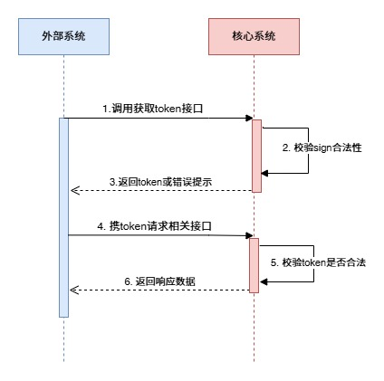

# 第三方接入接口文档

> Vic.xu

| 序号 | 版本 | 时间 | 说明 |
| --- | --- | --- | --- |
| 1 | V1.0.0 | 2026-07-30 | 第三方调用我方接口协议 |

## 一、概述

本文档用于第三方系统调用我方系统提供的接口。

所有请求和响应统一使用 `UTF-8` 编码。接口地址中的域名、业务 URL、`appId`、`username`、RSA 密钥由双方联调时提供。

## 二、调用流程



### 请求流程说明

```text
1. 第三方系统按签名规则生成 sign。
2. 第三方系统调用获取 token 接口。
3. 我方系统校验 appId、timestamp、username、nonce、sign。
4. 校验失败，返回错误信息。
5. 校验成功，返回 token。
6. 第三方系统携带 token 调用业务接口。
7. 我方系统校验 token。
8. token 有效，进入业务接口并返回业务数据。
9. token 不再使用时，第三方系统可调用注销 token 接口。
```

## 三、获取 Token 接口

### 1. 请求 URL

```text
POST /inbound/api/obtain-token
Content-Type: application/json
```

### 2. 请求参数

```json
{
  "sign": "xxxxx",
  "appId": "demo",
  "timestamp": 1778568450708,
  "username": "demo",
  "nonce": "123-abc"
}
```

| 参数 | 类型 | 是否必填 | 说明 |
| --- | --- | --- | --- |
| sign | String | 是 | 请求签名，详见 [六、sign 签名说明](#六sign-签名说明) |
| appId | String | 是 | 第三方应用标识，由我方分配 |
| timestamp | Long | 是 | 毫秒时间戳，请求时间与服务端时间误差默认不得超过 5 分钟 |
| username | String | 是 | 第三方用户名，由我方分配 |
| nonce | String | 否 | 请求随机字符串；如双方约定开启防重，则必填且同一时间窗内不能重复 |

### 3. 成功响应

```json
{
  "code": 0,
  "msg": "",
  "data": "12344555"
}
```

| 字段 | 说明 |
| --- | --- |
| code | 返回码，`0` 表示成功，其他表示失败 |
| msg | 错误说明 |
| data | token 字符串 |

token 默认有效期为 60 分钟。第三方系统应在本地缓存 token，并在过期后重新获取。

### 4. 失败响应

```json
{
  "code": 1,
  "msg": "sign verify failed",
  "data": null
}
```

第三方系统应以响应体中的 `code` 判断业务是否成功。

## 四、业务接口调用规则

具体业务接口由双方另行约定。

统一规则：

1. 业务接口 URL 建议统一以 `/inbound/api/` 为前缀。
2. 调用业务接口时必须携带 token。
3. 推荐通过请求头传递 token：

```text
X-Third-Token: xxxxxx
```

兼容方式：

```text
?token=xxxxxx
```

如 header 和参数同时传递，以 header 为准。

## 五、注销 Token 接口

### 1. 请求 URL

```text
POST /inbound/api/revoke-token
Content-Type: application/x-www-form-urlencoded
```

### 2. 请求参数

| 参数 | 类型 | 是否必填 | 说明 |
| --- | --- | --- | --- |
| token | String | 是 | 需要注销的 token |

请求示例：

```text
POST /inbound/api/revoke-token?token=12344555
```

### 3. 响应结果

```json
{
  "code": 0,
  "msg": "",
  "data": {
    "appId": "demo",
    "thirdCode": "demo",
    "username": "demo",
    "expireAt": "2026-07-30 12:00:00"
  }
}
```

注销成功后，该 token 不能继续访问业务接口。

## 六、sign 签名说明

### 1. 签名算法

```text
SHA256withRSA
```

### 2. 密钥规则

1. 第三方系统持有 RSA 私钥。
2. 第三方系统使用私钥对待签名字符串进行签名。
3. 我方系统使用对应 RSA 公钥进行验签。
4. 签名结果使用 Base64 字符串传输。

### 3. 待签名字符串格式

按以下固定顺序拼接：

```text
appId={appId}&timestamp={timestamp}&nonce={nonce}&username={username}
```

示例：

```text
appId=demo&timestamp=1778568450708&nonce=123-abc&username=kingdee
```

说明：

- `timestamp` 使用毫秒时间戳。
- `appId`、`nonce`、`username` 按 UTF-8 query 参数规则编码后参与签名。
- 如果双方未约定启用 nonce 防重，`nonce` 可以为空字符串，但仍按固定格式参与拼接。

## 七、Hutool 签名参考代码

以下代码仅供 Java 调用方参考，不限制第三方系统的具体实现语言。

```java
import java.nio.charset.StandardCharsets;

import cn.hutool.core.codec.Base64;
import cn.hutool.core.date.DateUtil;
import cn.hutool.core.util.URLUtil;
import cn.hutool.crypto.SignUtil;
import cn.hutool.crypto.asymmetric.RSA;
import cn.hutool.crypto.asymmetric.Sign;
import cn.hutool.crypto.asymmetric.SignAlgorithm;

public class ThirdSignDemo {

    public static void main(String[] args) {
        RSA rsa = new RSA();
        String publicKey = rsa.getPublicKeyBase64();
        String privateKey = rsa.getPrivateKeyBase64();

        long timestamp = DateUtil.current();
        String payload = buildTokenPayload("demo", "123-abc", timestamp, "demo");

        String sign = privateSign(payload, privateKey);
        boolean verified = publicVerify(sign, payload, publicKey);

        System.out.println("payload = " + payload);
        System.out.println("sign = " + sign);
        System.out.println("verified = " + verified);
    }

    private static String buildTokenPayload(String appId, String nonce, long timestamp, String username) {
        return "appId=" + encode(appId)
                + "&timestamp=" + timestamp
                + "&nonce=" + encode(nonce)
                + "&username=" + encode(username);
    }

    private static String privateSign(String data, String privateKey) {
        Sign sign = SignUtil.sign(SignAlgorithm.SHA256withRSA, privateKey, null);
        return Base64.encode(sign.sign(data.getBytes(StandardCharsets.UTF_8)));
    }

    private static boolean publicVerify(String signContent, String content, String publicKey) {
        Sign sign = SignUtil.sign(SignAlgorithm.SHA256withRSA, null, publicKey);
        return sign.verify(content.getBytes(StandardCharsets.UTF_8), Base64.decode(signContent));
    }

    private static String encode(String value) {
        return URLUtil.encodeQuery(value == null ? "" : value);
    }
}
```
