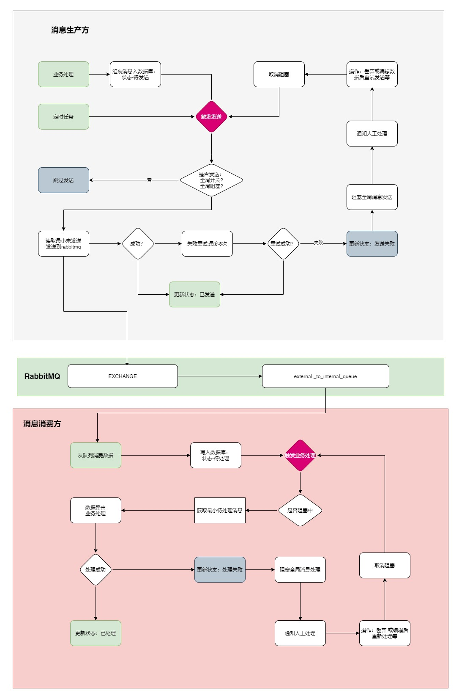

## lcxm-mq-data-bridge-spring-boot-starter
> 2025-02-26 start

基于RabbitMQ的系统间数据顺序交互starter: mq只单纯做数据扭转，发送和接收的数据都将先入本地库，适合少量数据交互

交互流程



```
└───bridge
    ├───annotation
    │       ActionHandler.java    消费方法上需要加的注解
    │       
    ├───autoconfigure
    │       DataBridgeAutoConfiguration.java   自动装配类入口
    │       DataBridgeProperties.java          自动装配配置类+
    │       
    ├───constant
    │       DataBridgeConstant.java             一些常量  
    │       
    ├───controller
    │       DataBridgeReceiveMessageController.java    消息接收表控制器
    │       DataBridgeSendMessageController.java       消息发送表控制器
    │       MqSwitchController.java                    全局开关控制器
    │       
    ├───core
    │       AbstractDataBridgeMessageConsumer.java      消费消息的基类，继承该类 配合ActionHandler
    │       DataBridgeMessageProducer.java              生产待发送的消息 的入口类
    │       DataBridgeMessageRouter.java                消息路由：消费本地消息表时候路由到不同的消费者
    │       DataBridgeStartupRunner.java                项目启动后 触发 异步发送和异步消费动作
    │       
    ├───enums
    │       OperationEnum.java                          操作类型：消费或发送消息
    │       ReceiveStatusEnum.java                      消息接收表状态枚举
    │       SendStatusEnum.java                         消息发送表状态枚举
    │       
    ├───event
    │       DataBridgeMqEventHandler.java              MQ 监听器事件处理器
    │       DataBridgeMqListenerStartEvent.java        MQ 监听器启动事件 
    │       DataBridgeMqListenerStopEvent.java         MQ 监听器停止事件
    │       
    ├───facade
    │       AbstractDataBridgeMessageFacade.java       门面基类：操作前串行化判断，操作后重置锁等状态
    │       DataBridgeMessageReceiverFacade.java       扫描本地消息接收表，调用DataBridgeMessageRouter处理消息
    │       DataBridgeMessageSenderFacade.java         扫描本地消息发送表，调用DataBridgeMqMessageSender发送消息 
    │       
    ├───helper
    │       ClusterOperationStateManagerHelper.java    同步操作帮助类: 保证消费消息和发送消息 集群下串行化处理
    │       DataBridgeGlobalConfigHelper.java          全局配置帮助类  
    │       DataBridgeMqListenerSwitchHelper.java      MQ 监听器开关 帮助类
    │       
    ├───mapper                                         mybatis Mapper                     
    │       DataBridgeReceiveMessageMapper.java        
    │       DataBridgeReceiveMessageMapper.xml
    │       DataBridgeSendMessageMapper.java
    │       DataBridgeSendMessageMapper.xml
    │       
    ├───model                                         model                  
    │       ActionHandlerModel.java
    │       DataBridgeReceiveMessage.java
    │       DataBridgeSendMessage.java
    │       MessageContentWrapper.java
    │       
    ├───mq
    │       DataBridgeMqMessageReceiver.java          接收MQ 消息的入口类
    │       DataBridgeMqMessageSender.java            发送消息到 MQ 的入口
    │       
    ├───service                                       service      
    │       DataBridgeReceiveMessageService.java
    │       DataBridgeSendMessageService.java
    │       
    └───vo                                           VO                               
            AbstractDataBridgeVo.java
            DataBridgeEnableVO.java
```